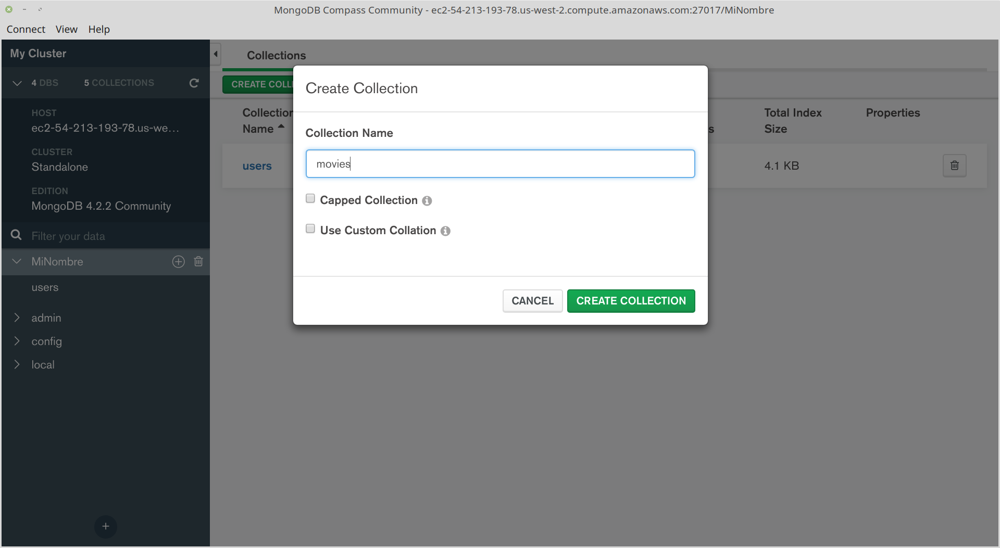
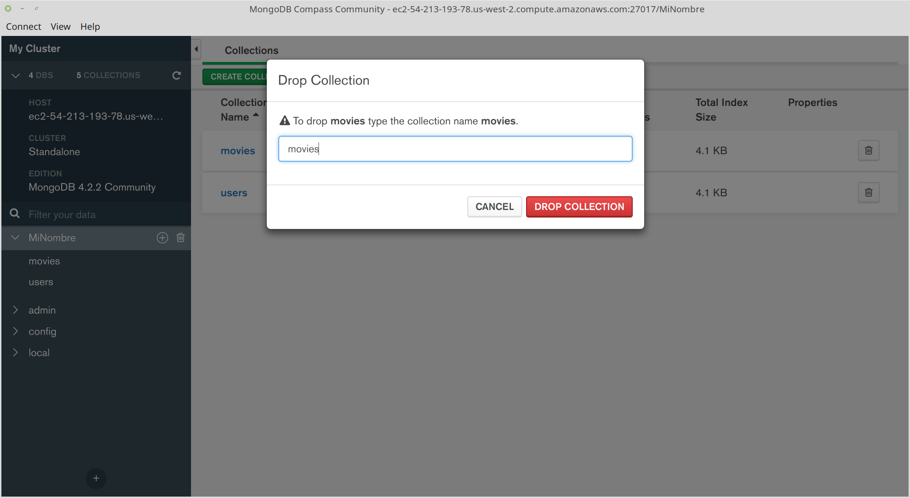
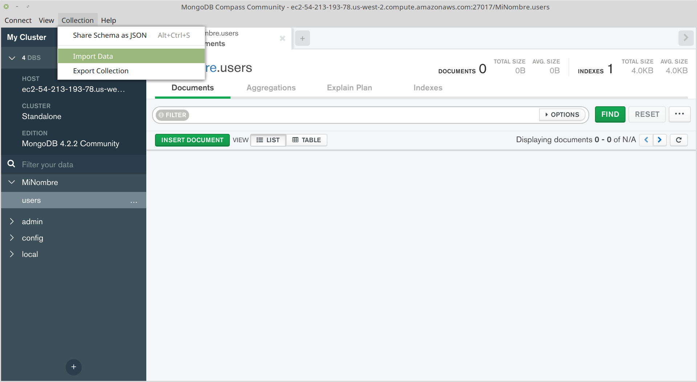
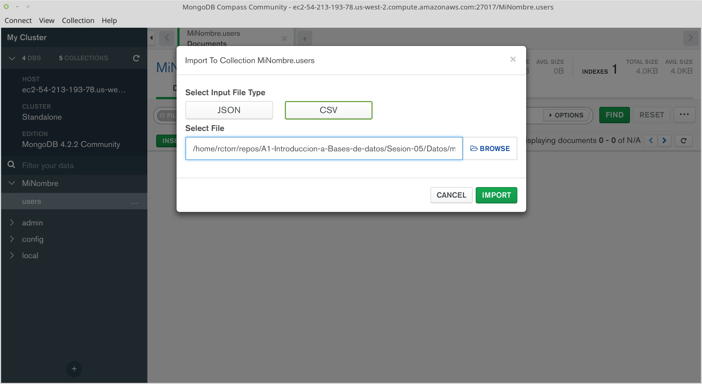
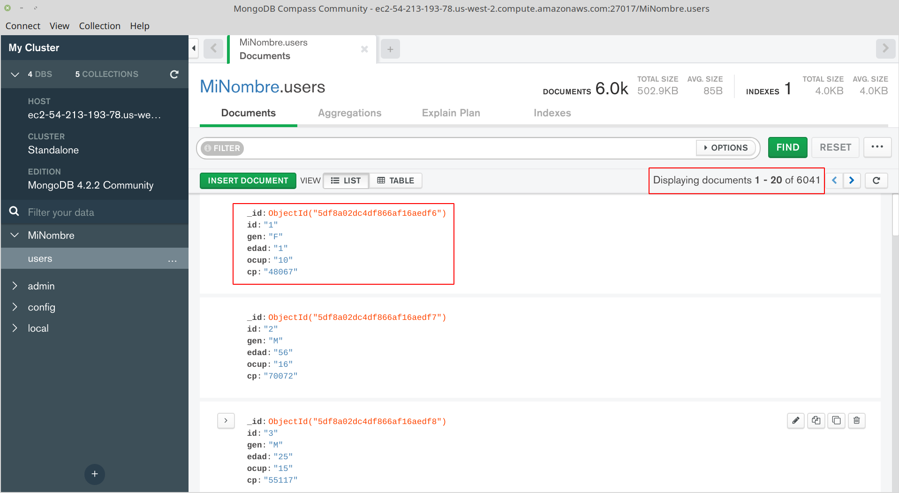
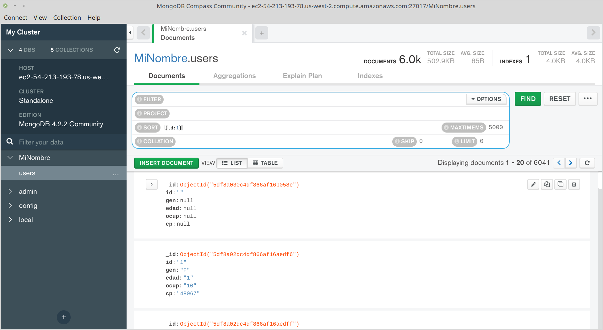
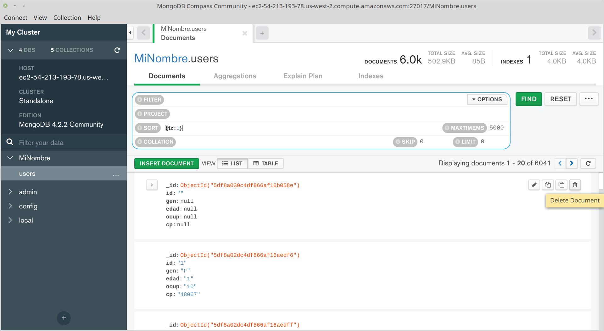
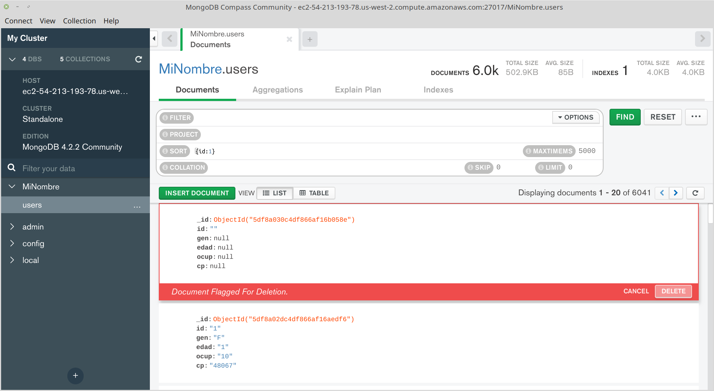

[`Fundamentos de Base de Datos`](../../Readme.md) > [`Sesión 05`](../Readme.md) > Ejemplo-02
## Realizando operaciones con Colecciones

### OBJETIVO
- Que el alumno realice operaciones con Colecciones
- Que el alumno cuente con una Colección para importar datos
- Que el alumno importe datos en formato CSV a una Colección.

### REQUISITOS
1. Repositorio actualizado
1. Usar la carpeta de trabajo `Sesion-05/Ejemplo-02`

### DESARROLLO
Las Colecciones en MongoDB son el equivalente a las Tablas en SQL, así que cada archivo en formato CSV necesita de una Coleción para poder ser importado.

A diferencia de SQL, las Colecciones sólo se crean y no es necesario definir campos y tipos de datos.

1. Partiendo de la lista de colecciones obtenida al final del ejemplo anterior, se procederá a crear una nueva colección llamada `movies`.

   
   Para crear una coleción, se presiona el botón `CREATE COLLECTION`, se escribe el nombre de la colección a crear y se presiona el botón `CREATE COLLECTION`
   
   Ahora se ve la lista de las bases de datos nuevamente, así que se dá click sobre la base de datos con tu nombre y se verá algo similar a lo siguiente:
   

1. Las colecciones al igual que las bases de datos también se pueden eliminar presionando el botón con icono de bote de basura, en este caso se borrará la colección `movies`.
   
   Se tiene que escribir la colección a borrar y luego presionar el botón `DROP COLLECTION`, tras lo cual aparece nuevamente la lista de bases de datos, así que hay que seleccionar nuevamente tu base de datos dando click sobre el nombre y se deberá de ver nuevamente sólo la coleción de `users`
   

1. Antes de continuar es necesario copiar la carpeta `Sesion-04/Datos` a la carpeta `Sesion-05`
   ```console
   Sesion-05 $ cp -a ../Sesion-04/Datos .
   Sesion-05 $
   ```

1. Para importar datos a una colección lo primero es seleccionar la colección dando click sobre el nombre, en este caso `users`

   Una colección agrupa o almacena `Documentos`, que corresponden a `Registros` en SQL, al seleccionar la colección se muestra la lista de documentos:
   

   Como la colección se acaba de crear, la lista de documentos está vacía, así que para importar documentos, se usa la opción del menú `Collection > Import Data` que abre un diálogo para seleccionar del tipo de archivo y el archivo mismo.
   
   Importante seleccionar el formato CSV y al elegir el archivo, seleccionar el archivo `users-h.csv`, recuerda que este archivo incluye un primer registro con el nombre de las columnas, que `MongoDB` usará para crear los documentos (o registros)
   
   Ahora si ya aparecen documentos y se puede comprobar que cada campo tiene nombre y valor, así que la importación en relación a los campos es correcta

   Otro forma de comprobar la correcta importación es la cantidad de documentos, y se observa que hay 6041 documentos (o registros) en la colección, lo que indica que hay un documento de más en la colección ya que el archivo csv tiene 6040 registros, entonces ¿qué ha pasado?

1. El paso final es determinar cual es el registro extra, para ello se da click en el botón `OPTION` y en la línea que dice `SORT` se escribe lo siguiente:
   ```json
   {id:1}
   ```
   Esto indica que los resultados se ordenen en base al campo `id` de forma ascendente, es el equivalente al `ORDER BY` en SQL. ¿cual sería el valor para ordenar de forma descendente?

   Dar click en el botón `FIND` o presionar la tecla `ENTER` para actualizar la lista de registros.
   

   Se puede observar que el primer documento está vació, posiblemente debido a que la última línea en el archivo `users-h.csv` termina en una nueva línea, así que se procede a eliminar este documento en blanco presionando el icono de bote de basura para el primer documento
   

   Y luego se da click en el botón `DELETE`
   

   Después entonces el total de documento es 6040 como era de esperar.

__Misión cumplida__
